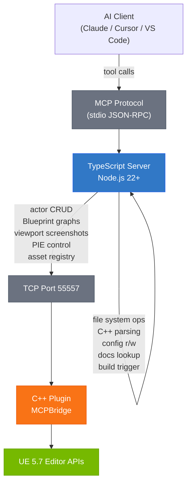

# Ultimate Unreal Engine MCP

**129 tools. 26 domains. Full read/write access to Unreal Engine 5.7 — including live editor APIs, Blueprint graphs, and viewport screenshots.**

[](LICENSE)
[](https://nodejs.org/)
[](https://www.unrealengine.com/)
[](#development)
[](#tool-catalog)

MCP (Model Context Protocol) is a standard that lets AI assistants call tools on external systems — this server exposes Unreal Engine as those tools.

```bash
npx ultimate-unreal-engine-mcp setup
```

---

## Table of Contents

- [Quick Start](#quick-start)
- [What You Can Do](#what-you-can-do)
- [Architecture](#architecture)
- [Tool Catalog](#tool-catalog)
- [Visual Review Loop](#visual-review-loop)
- [Headless vs Live](#headless-vs-live)
- [Installation](#installation)
- [C++ Plugin Setup](#c-plugin-setup)
- [Configuration](#configuration)
- [Development](#development)
- [Requirements](#requirements)
- [License](#license)

---

## Quick Start

```bash
# Claude Desktop (default)
npx ultimate-unreal-engine-mcp setup

# Claude Code CLI
npx ultimate-unreal-engine-mcp setup --client claude-code

# Cursor
npx ultimate-unreal-engine-mcp setup --client cursor

# With a UE project (also installs the C++ plugin)
npx ultimate-unreal-engine-mcp setup --project "C:/MyGame"
```

This command writes the correct config for your client. The C++ plugin is optional — file system and code generation tools work without it.

---

## What You Can Do

The following walkthrough shows AI autonomously setting up a point light, doing a visual review loop, and correcting an intensity problem — all without leaving the conversation.

---

**Prompt:** "Spawn a point light named MainLight at the center of the level, set its intensity to 5000, then take a screenshot so I can review it."

**Step 1 — Spawn the actor**

```
ue_spawn_actor(class="PointLight", label="MainLight", location={x:0, y:0, z:300})
```

> **Claude:** Actor `MainLight` spawned at (0, 0, 300). UE returned `actor_id: "PointLight_0"`.

---

**Step 2 — Navigate camera to the actor**

```
ue_look_at(target="MainLight", angle="45deg", screenshot=true)
```

> **Claude:** Camera positioned. [Screenshot returned inline — shows a bright white sphere flooding the scene with overexposed light.]

---

**Step 3 — Visual review — something is wrong**

```
ue_visual_review(focus="check if the lighting looks blown out")
```

> **Claude:** The scene is severely overexposed. The intensity of 5000 lm is too high for this room scale. Reducing to 800 lm.

---

**Step 4 — Adjust the property**

```
ue_transform_actor(label="MainLight", properties={"Intensity": 800})
```

> **Claude:** Property `Intensity` updated to 800 on `MainLight`.

---

**Step 5 — Verify the fix**

```
ue_orbit_review(target="MainLight", angles=[0, 90, 180, 270])
```

> **Claude:** [Four screenshots returned — front, right, back, left.] Lighting is balanced. No blown-out surfaces visible from any angle. The area is well-lit without overexposure.

---

**Step 6 — Cleanup**

```
ue_cleanup_screenshots(confirm=true)
```

> **Claude:** 5 MCP-generated screenshots removed from disk.

---

This loop — spawn, navigate, inspect, adjust, verify — runs entirely from the AI conversation. No manual editor interaction required.

---

## Architecture



**TypeScript layer** handles all file system operations without requiring the editor to be open: C++ header parsing (tree-sitter-unreal-cpp), INI config read/write, code generation, documentation lookup, and build triggering via UnrealBuildTool.

**C++ plugin layer** (MCPBridge) provides live editor access: actor CRUD, Blueprint graph read/write, viewport screenshots with inline base64 images, PIE session control, asset registry queries, and all other operations that require the UE Editor process.

---

## Tool Catalog

<details>
<summary><strong>AI Systems</strong> — 5 tools</summary>

| Tool | Description |
|------|-------------|
| `ue_inspect_behavior_tree` | Inspect a Behavior Tree asset — tasks, decorators, services, and composite nodes |
| `ue_inspect_state_tree` | Inspect a State Tree asset — states, transitions, and evaluators |
| `ue_inspect_blackboard` | Read Blackboard asset key definitions and their types |
| `ue_inspect_eqs` | Inspect an Environment Query System asset — tests and generators |
| `ue_query_navmesh` | Query NavMesh coverage for a location or actor |

</details>

<details>
<summary><strong>Animation</strong> — 5 tools</summary>

| Tool | Description |
|------|-------------|
| `ue_list_animation_assets` | List animation assets in the project, optionally filtered by type |
| `ue_inspect_anim_blueprint` | Inspect AnimBP state machines, states, and transitions |
| `ue_inspect_montage` | Read montage sections, notifies, and slot assignments |
| `ue_inspect_blend_space` | Inspect blend space axes, samples, and grid configuration |
| `ue_read_retarget_mappings` | Read IK Retargeter source/target rig and chain mappings |

</details>

<details>
<summary><strong>Audio</strong> — 4 tools</summary>

| Tool | Description |
|------|-------------|
| `ue_list_sound_assets` | List all sound assets in the project |
| `ue_inspect_metasound` | Inspect a MetaSound asset — nodes, inputs, outputs, and patches |
| `ue_inspect_sound_cue` | Inspect a Sound Cue asset — nodes and audio connections |
| `ue_query_audio_insights` | Query Audio Insights data for active sounds and buses |

</details>

<details>
<summary><strong>Blueprint</strong> — 11 tools</summary>

| Tool | Description |
|------|-------------|
| `ue_read_blueprint` | Read a Blueprint asset — class defaults, components, and interfaces |
| `ue_list_blueprints` | List Blueprint assets matching a class filter |
| `ue_read_blueprint_graph` | Read Blueprint graph nodes, pins, and connections |
| `ue_create_blueprint` | Create a new Blueprint class with a specified parent |
| `ue_add_blueprint_node` | Add a function call or event node to a Blueprint graph |
| `ue_connect_blueprint_pins` | Connect two pins in a Blueprint graph |
| `ue_add_blueprint_variable` | Add a new variable to a Blueprint class |
| `ue_set_blueprint_default` | Set a Blueprint class default property value |
| `ue_cpp_exposed_members` | List C++ properties and functions exposed to Blueprint in a class |
| `ue_find_blueprint_subclasses` | Find all Blueprints that subclass a given C++ or Blueprint class |
| `ue_trace_cpp_in_blueprints` | Find all Blueprints referencing a specific C++ class |

</details>

<details>
<summary><strong>Build</strong> — 2 tools</summary>

| Tool | Description |
|------|-------------|
| `ue_build` | Trigger a UnrealBuildTool build for a target and configuration |
| `ue_get_build_errors` | Read the latest build output and parse compiler errors |

</details>

<details>
<summary><strong>Chaos Physics</strong> — 4 tools</summary>

| Tool | Description |
|------|-------------|
| `ue_inspect_geometry_collection` | Inspect a Geometry Collection asset — fracture levels and clusters |
| `ue_reset_destruction` | Reset a destructible actor to its initial un-fractured state |
| `ue_read_cloth_params` | Read Chaos Cloth asset simulation parameters |
| `ue_manage_physics_cache` | Manage Chaos physics cache recording and playback |

</details>

<details>
<summary><strong>Collision &amp; Physics</strong> — 4 tools</summary>

| Tool | Description |
|------|-------------|
| `ue_read_collision` | Read collision profile, channels, and response matrix for an actor or component |
| `ue_set_collision` | Set collision preset or individual channel responses |
| `ue_manage_physical_material` | Read or update Physical Material properties |
| `ue_inspect_physics_asset` | Inspect a Physics Asset — bodies, constraints, and welded bones |

</details>

<details>
<summary><strong>Config</strong> — 4 tools</summary>

| Tool | Description |
|------|-------------|
| `ue_read_config` | Read a UE INI config file section or key |
| `ue_write_config` | Write or update a key in a UE INI config file |
| `ue_read_uproject` | Read .uproject metadata — engine version, plugins, target platforms |
| `ue_list_plugins` | List all plugins enabled in the project with their versions |

</details>

<details>
<summary><strong>C++</strong> — 8 tools</summary>

| Tool | Description |
|------|-------------|
| `ue_read_cpp_class` | Parse a C++ header and return UCLASS, UPROPERTY, and UFUNCTION metadata |
| `ue_get_class_hierarchy` | Walk the class hierarchy from a UClass up to UObject |
| `ue_trace_includes` | List all #include dependencies for a header file |
| `ue_find_class_file` | Locate the header file for a UClass by name |
| `ue_generate_class` | Generate a new C++ class scaffold with UClass boilerplate |
| `ue_add_property` | Add a UPROPERTY declaration to an existing C++ class |
| `ue_add_function` | Add a UFUNCTION declaration to an existing C++ class |
| `ue_add_include` | Add an #include to a C++ source or header file |

</details>

<details>
<summary><strong>Docs</strong> — 4 tools</summary>

| Tool | Description |
|------|-------------|
| `ue_search_api` | Full-text search over the local UE API documentation index |
| `ue_lookup_class` | Look up a UClass reference page — methods, properties, hierarchy |
| `ue_get_include_path` | Get the correct #include path for a UE class |
| `ue_check_deprecation` | Check if a class, function, or macro is deprecated in UE 5.7 |

</details>

<details>
<summary><strong>Editor</strong> — 7 tools</summary>

| Tool | Description |
|------|-------------|
| `ue_list_actors` | List actors in the current level with transforms and class info |
| `ue_spawn_actor` | Spawn an actor by class into the current level |
| `ue_transform_actor` | Move, rotate, scale, or set properties on an actor |
| `ue_delete_actor` | Delete an actor from the current level |
| `ue_query_assets` | Query the asset registry — search by class, path, or name |
| `ue_trace_references` | Trace all assets that reference or are referenced by an asset |
| `ue_read_level_layout` | Read the current level's actor graph and spatial layout |

</details>

<details>
<summary><strong>GAS (Gameplay Ability System)</strong> — 4 tools</summary>

| Tool | Description |
|------|-------------|
| `ue_list_abilities` | List all Gameplay Ability assets in the project |
| `ue_inspect_gameplay_effect` | Inspect a Gameplay Effect — modifiers, duration policy, and tags |
| `ue_read_attribute_set` | Read an Attribute Set class — attribute names and base values |
| `ue_query_gameplay_tags` | Query the Gameplay Tag hierarchy and registered tags |

</details>

<details>
<summary><strong>Import/Export</strong> — 4 tools</summary>

| Tool | Description |
|------|-------------|
| `ue_import_fbx` | Import an FBX file as a Static Mesh or Skeletal Mesh asset |
| `ue_import_usd` | Import a USD file into the project |
| `ue_export_mesh` | Export a Static Mesh or Skeletal Mesh asset to FBX |
| `ue_batch_import` | Import multiple assets from a directory in a single operation |

</details>

<details>
<summary><strong>Input</strong> — 4 tools</summary>

| Tool | Description |
|------|-------------|
| `ue_list_input_actions` | List all Input Action assets in the project |
| `ue_create_input_action` | Create a new Input Action asset with a specified value type |
| `ue_list_input_contexts` | List all Input Mapping Context assets in the project |
| `ue_add_input_binding` | Add a key binding to an Input Mapping Context |

</details>

<details>
<summary><strong>Known Issues</strong> — 2 tools</summary>

| Tool | Description |
|------|-------------|
| `ue_list_known_issues` | List all logged known issues for the current project session |
| `ue_add_known_issue` | Log a new known issue with severity and context for later resolution |

</details>

<details>
<summary><strong>Live Link</strong> — 4 tools</summary>

| Tool | Description |
|------|-------------|
| `ue_list_livelink_sources` | List all active Live Link sources and their connection status |
| `ue_list_livelink_subjects` | List all Live Link subjects from active sources |
| `ue_control_livelink_subject` | Enable, disable, or configure a Live Link subject |
| `ue_preview_livelink_data` | Preview current frame data for a Live Link subject |

</details>

<details>
<summary><strong>Material</strong> — 4 tools</summary>

| Tool | Description |
|------|-------------|
| `ue_material_params` | Read all scalar, vector, and texture parameters from a material |
| `ue_create_material_instance` | Create a Material Instance from a parent material |
| `ue_set_material_param` | Set a scalar, vector, or texture parameter on a Material Instance |
| `ue_actor_materials` | List all materials assigned to components on an actor |

</details>

<details>
<summary><strong>Motion Design</strong> — 4 tools</summary>

| Tool | Description |
|------|-------------|
| `ue_list_scene_states` | List all Motion Design scene states |
| `ue_trigger_scene_transition` | Trigger a scene state transition |
| `ue_inspect_transition_logic` | Inspect the logic for a Motion Design scene transition |
| `ue_manage_remote_control` | Manage Motion Design remote control presets and bindings |

</details>

<details>
<summary><strong>Movie Render Pipeline</strong> — 4 tools</summary>

| Tool | Description |
|------|-------------|
| `ue_list_render_queue` | List all jobs in the Movie Render Queue |
| `ue_add_render_job` | Add a render job to the Movie Render Queue |
| `ue_control_render_queue` | Start, pause, or cancel the render queue |
| `ue_configure_render_output` | Configure output format, resolution, and path for a render job |

</details>

<details>
<summary><strong>Networking</strong> — 4 tools</summary>

| Tool | Description |
|------|-------------|
| `ue_inspect_replication` | Inspect replication settings for an actor or component |
| `ue_list_replicated_properties` | List all UPROPERTY members with replication conditions |
| `ue_read_net_driver` | Read Net Driver configuration — tick rate, max clients, bandwidth |
| `ue_inspect_session` | Inspect the current network session state during PIE |

</details>

<details>
<summary><strong>PCG (Procedural Content Generation)</strong> — 4 tools</summary>

| Tool | Description |
|------|-------------|
| `ue_list_pcg_graphs` | List all PCG Graph assets in the project |
| `ue_inspect_pcg_graph` | Inspect a PCG Graph — nodes, connections, and parameters |
| `ue_execute_pcg_graph` | Execute a PCG Graph on a target actor |
| `ue_query_pcg_results` | Query the output data from the last PCG Graph execution |

</details>

<details>
<summary><strong>Selection</strong> — 4 tools</summary>

| Tool | Description |
|------|-------------|
| `ue_select_actors` | Select actors in the editor by label, class, or spatial query |
| `ue_get_selection` | Get the current editor selection — actor labels and transforms |
| `ue_duplicate_actors` | Duplicate selected actors with optional offset |
| `ue_convert_actor` | Convert an actor to a different class in place |

</details>

<details>
<summary><strong>Sequencer</strong> — 5 tools</summary>

| Tool | Description |
|------|-------------|
| `ue_create_sequence` | Create a new Level Sequence asset |
| `ue_list_sequence_tracks` | List all tracks in a Level Sequence |
| `ue_add_sequence_track` | Add a track (Transform, Property, Event, etc.) to a Level Sequence |
| `ue_add_keyframe` | Add a keyframe to a Sequencer track at a specific time |
| `ue_sequence_playback` | Control Sequencer playback — play, pause, stop, set time |

</details>

<details>
<summary><strong>Validation</strong> — 4 tools</summary>

| Tool | Description |
|------|-------------|
| `ue_validate_asset` | Run Editor Validation on a single asset and return issues |
| `ue_validate_folder` | Validate all assets in a content folder |
| `ue_validate_project` | Run full project validation and return a summary report |
| `ue_check_blueprint` | Check a Blueprint for compilation errors without compiling |

</details>

<details>
<summary><strong>Viewport &amp; Visual Review</strong> — 16 tools</summary>

| Tool | Description |
|------|-------------|
| `ue_editor_state` | Query selected actors, open assets, and viewport camera position |
| `ue_pie_start` | Start a Play In Editor (PIE) session |
| `ue_pie_stop` | Stop the active PIE session |
| `ue_pie_logs` | Read PIE output log lines since session start |
| `ue_pie_game_state` | Query runtime game state — actor positions, active GameMode |
| `ue_viewport_screenshot` | Capture the active viewport as an inline base64 image |
| `ue_viewport_camera` | Set camera position, rotation, FOV, or look-at target |
| `ue_viewport_render_mode` | Switch render mode: lit, unlit, wireframe, collision, detail_lighting |
| `ue_viewport_hires_screenshot` | High-resolution screenshot with configurable resolution multiplier |
| `ue_visual_review` | Quick screenshot for iterative visual review loops |
| `ue_look_at` | Navigate camera to an actor or world position with optional screenshot |
| `ue_orbit_review` | Multi-angle screenshots orbiting a target |
| `ue_iterate_scene` | Screenshot + nearby actor data in a single call |
| `ue_fly_through` | Camera waypoint walkthrough with a screenshot at each stop |
| `ue_focus_actor` | Auto-frame an actor by label with bounds-aware distance |
| `ue_cleanup_screenshots` | Delete MCP-generated screenshots to free disk space |

</details>

<details>
<summary><strong>World Partition</strong> — 4 tools</summary>

| Tool | Description |
|------|-------------|
| `ue_read_world_partition` | Read World Partition grid configuration and cell layout |
| `ue_manage_data_layers` | List, enable, or disable World Partition Data Layers |
| `ue_inspect_streaming_sources` | Inspect streaming source locations and activation radii |
| `ue_trigger_hlod_generation` | Trigger HLOD generation for a World Partition level |

</details>

---

## Visual Review Loop

The Viewport & Visual Review domain enables an AI to navigate, see, judge, and act — autonomously.

```
navigate → screenshot → inspect → adjust → verify → cleanup
```

**Core tools:**

| Tool | Role in the loop |
|------|-----------------|
| `ue_look_at` | Navigate camera to any actor or world position, auto-frame, screenshot |
| `ue_visual_review` | Quick screenshot with optional focus hint ("check the shadows on the left wall") |
| `ue_orbit_review` | Capture 2–12 angles around a target in one call |
| `ue_iterate_scene` | Screenshot + actor data together — orient yourself in one round trip |
| `ue_fly_through` | Waypoint walkthrough — systematic spatial survey of a level section |
| `ue_focus_actor` | Auto-frame a specific actor using its bounding box |
| `ue_cleanup_screenshots` | Delete all MCP screenshots when the session is done |

**What makes this different:** Screenshots are returned as inline base64 images in the MCP response. The AI receives and interprets the image in the same tool call — no file paths to resolve, no secondary reads. The AI can see the scene, evaluate it, and call the next tool in the same turn.

**Typical loop:**

```
ue_look_at("TargetActor", angle="45deg")
  → [image inline] AI sees overexposed area
ue_transform_actor("TargetActor", {"Intensity": 500})
  → property updated
ue_orbit_review("TargetActor", angles=[0, 90, 180, 270])
  → [4 images inline] all clear from every angle
ue_cleanup_screenshots(confirm=true)
  → disk cleaned
```

---

## Headless vs Live

Some tools work without the UE Editor running. Others require the MCPBridge plugin connected to a live editor instance.

| Headless (no plugin required) | Live Editor Required |
|-------------------------------|----------------------|
| Read and write C++ headers | Actor spawn, move, delete |
| Parse UCLASS/UPROPERTY/UFUNCTION macros | Blueprint graph read/write |
| Generate C++ class scaffolds | Viewport screenshots |
| Read and write INI config files | PIE start/stop/logs |
| Read .uproject and plugin list | Asset registry queries |
| Trigger UnrealBuildTool builds | Animation Blueprint inspection |
| Parse build errors | Material parameter get/set |
| Search and browse API documentation | Level Sequencer control |
| Look up class include paths | World Partition management |
| Check deprecation status | GAS, PCG, Physics, Networking |

The TypeScript server starts in headless mode by default. Tools that require the plugin return a structured `plugin_not_connected` error with a clear message — they never silently fail.

---

## Installation

### Option 1: npx (quickest)

```bash
npx ultimate-unreal-engine-mcp setup
```

Detects your MCP client and writes the config automatically.

### Option 2: Global install

```bash
npm install -g ultimate-unreal-engine-mcp
ultimate-unreal-engine-mcp setup
```

### Option 3: Clone for development

```bash
git clone https://github.com/your-org/ultimateunrealenginemcp
cd ultimateunrealenginemcp
npm install
npm run build
```

### Client configuration

**Claude Desktop** (`~/Library/Application Support/Claude/claude_desktop_config.json` on macOS, `%APPDATA%\Claude\claude_desktop_config.json` on Windows):

```json
{
  "mcpServers": {
    "unreal": {
      "command": "npx",
      "args": ["ultimate-unreal-engine-mcp"],
      "env": {
        "UE_PROJECT_ROOT": "/path/to/your/UEProject",
        "UE_PLUGIN_PORT": "55557"
      }
    }
  }
}
```

**Cursor** (`.cursor/mcp.json` in your project):

```json
{
  "mcpServers": {
    "unreal": {
      "command": "npx",
      "args": ["ultimate-unreal-engine-mcp"],
      "env": {
        "UE_PROJECT_ROOT": "${workspaceFolder}",
        "UE_PLUGIN_PORT": "55557"
      }
    }
  }
}
```

**VS Code** (`.vscode/settings.json`):

```json
{
  "mcp.servers": {
    "unreal": {
      "command": "npx",
      "args": ["ultimate-unreal-engine-mcp"],
      "env": {
        "UE_PROJECT_ROOT": "${workspaceFolder}",
        "UE_PLUGIN_PORT": "55557"
      }
    }
  }
}
```

---

## C++ Plugin Setup

The MCPBridge plugin provides the live editor connection. Without it, all file system and code generation tools still work.

**Install:**

1. Copy `unreal-plugin/MCPBridge` into your project's `Plugins/` directory:

```
YourProject/
  Plugins/
    MCPBridge/
      MCPBridge.uplugin
      Source/
        MCPBridgeRuntime/
        MCPBridgeEditor/
```

2. Open your `.uproject` in a text editor and add the plugin:

```json
{
  "Plugins": [
    {
      "Name": "MCPBridge",
      "Enabled": true
    }
  ]
}
```

3. Right-click the `.uproject` file and select "Generate Visual Studio project files" (or run UnrealBuildTool). Build the project from your IDE.

4. Open the project in the UE Editor. The MCPBridge plugin initializes automatically and listens on port 55557.

**Verify the connection:**

```bash
curl http://localhost:55557/health
# → {"status":"ok","version":"1.0"}
```

**Change the port:**

Set `UE_PLUGIN_PORT` in your MCP client config and restart the editor. The plugin reads the port from a config ini on startup.

---

## Configuration

| Variable | Default | Description |
|----------|---------|-------------|
| `UE_PROJECT_ROOT` | Current working directory | Absolute path to the root of your Unreal project (the folder containing the `.uproject` file) |
| `UE_PLUGIN_PORT` | `55557` | TCP port the MCPBridge plugin listens on inside the editor |

Both variables are optional. `UE_PROJECT_ROOT` defaults to `process.cwd()`, which works correctly when the MCP server is started from inside the project directory.

---

## Development

```bash
# Start dev server with hot reload
npm run dev

# Run all tests
npm test

# Run tests in watch mode
npm run test:watch

# Build production output
npm run build

# Lint
npm run lint
```

**Test coverage:** 1021 tests across 43 files.

The test suite covers all 26 tool domains, plugin bridge connection/disconnection behavior, INI config parsing edge cases, C++ header parsing with tree-sitter-unreal-cpp, and known-issues middleware.

**Tech stack:** TypeScript 5.x, Node.js 22+, `@modelcontextprotocol/sdk` 1.29.0, Zod 3.25+, Vitest 2.x, tree-sitter-unreal-cpp (WASM), MiniSearch, fast-glob, chokidar.

---

## Requirements

- **Node.js 22+** — the MCP server runtime
- **MCP-compatible client** — Claude Desktop, Cursor, VS Code with MCP extension, or any client implementing the MCP protocol
- **Unreal Engine 5.7** — required only for tools marked `[requires_plugin]`; file system tools work with any UE version

---

## License

MIT — see [LICENSE](LICENSE).
